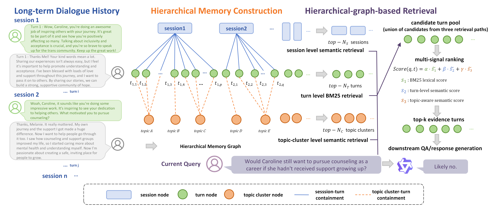

# HG-Mem: Hierarchical Graph and Multi-Path Retrieval based Long-Term Memory Management for Conversational Agents

Guo Yuhang, Fan Yanfang\*, Chen Ruoyu, Cai Ying, Wang Jingqi, Li Haitao,
He Xiaoye, Ji Zhenghao

College of Computer Science, Beijing Information Science & Technology
University, Beijing 102206, China

\* Corresponding author: fyfhappy@bistu.edu.cn

> Official PyTorch implementation of the paper above.

---

## Highlights

- **HG-Mem** builds a hierarchical memory graph (Session → Topic-Cluster → Turn)
  for long-term memory management.
- **HG-Mem** proposes multi-path retrieval with multi-signal ranking for
  fine-grained evidence localization.
- The training-free retrieval method introduces **no additional LLM calls** at
  query time, while maintaining low retrieval latency.
- HG-Mem improves retrieval and end-to-end question answering over existing
  methods on **LoCoMo** and **LongMemEval** datasets.

---

## Overview



HG-Mem is a **training-free**, **hierarchical-graph-based** long-term memory
management framework tailored for conversational agents. It organizes dialogue
history into a hierarchical memory graph consisting of three node types:

| Layer | Node type   | Content                                          |
| ----- | ----------- | ------------------------------------------------ |
| L3    | Session     | LLM-generated session summary                    |
| L2    | Turn        | Original dialogue turn (speaker + text)          |
| L1    | Topic-Cluster | LLM-generated turn topics, clustered per session |

Two types of **entailment edges** connect high-level semantic nodes to their
original turn-level evidence:

- **Session → Turn**: links a session node to every turn it contains.
- **Topic-Cluster → Turn**: links a cluster node to the turns it groups.

At retrieval time, HG-Mem performs **three-path candidate recall** and then
**multi-signal ranking**:

1. **BM25 path** — direct lexical matching between the query and turn text.
2. **Session path** — cosine similarity between the query and session
   summaries; top-*k* sessions are expanded to all their constituent turns.
3. **Topic-Cluster path** — cosine similarity between the query and topic
   clusters; top-*k* clusters are expanded to their contained turns (a more
   *local* expansion than the session path).

The merged candidate set is then re-ranked using three normalized signals:

- **BM25 lexical score** — captures entity / number / proper-noun matches.
- **Turn-level semantic score** — captures fine-grained semantic relevance.
- **Topic-aware semantic score** — captures local topical relevance.

A weighted sum yields the final top-*k* evidence turns, which are guaranteed
to be *original* dialogue turns and not compressed representations.

---

## Repository Layout

```
HG-Mem/
├── README.md                   # This file
├── LICENSE                     # MIT License
├── paper/
│   ├── HG-Mem.pdf              # Pre-print of the paper
│   ├── method.png              # Framework figure (Figure 1 of the paper)
│   ├── METHOD.md               # Method details & equations
│   └── README.md               # Description of the paper materials
├── dataset/
│   └── README.md               # Download links, format, sources and licenses
│                               # (the two benchmark JSONs are downloaded here)
└── experiment/
    ├── graph_vs_baselines_LoCoMo.py      # HG-Mem experiments on LoCoMo
    ├── graph_vs_baselines_LongMemEval.py # HG-Mem experiments on LongMemEval
    ├── requirements.txt        # Python dependencies
    ├── README.md               # How to reproduce all reported results
    ├── A-MEM/                  # Baseline: Agentic Memory (A-Mem)
    ├── MemGAS/                 # Baseline: MemGAS
    └── Secom/                  # Baseline: SeCom
```

---

## Datasets

Neither benchmark is tracked by git — both raw JSON files are fetched from
HuggingFace and left in the working tree under `dataset/`. The LongMemEval
split is **≈ 265 MB**, far above GitHub's 100 MB per-file hard limit, and
LoCoMo is kept out of the repository for symmetry, so both are downloaded
with the same one-time step:

| Benchmark | File | Size | Download link |
| --------- | ---- | ---- | ------------- |
| LoCoMo (10 conversations) | `dataset/locomo10.json` | ≈ 2.7 MB | <https://huggingface.co/datasets/KimmoZZZ/locomo/resolve/main/locomo10.json> |
| LongMemEval (500 items) | `dataset/longmemeval_s_cleaned.json` | ≈ 265 MB | <https://huggingface.co/datasets/xiaowu0162/longmemeval-cleaned/resolve/main/longmemeval_s_cleaned.json> |

```bash
# from the repository root
curl -L -o dataset/locomo10.json \
    https://huggingface.co/datasets/KimmoZZZ/locomo/resolve/main/locomo10.json

curl -L -o dataset/longmemeval_s_cleaned.json \
    https://huggingface.co/datasets/xiaowu0162/longmemeval-cleaned/resolve/main/longmemeval_s_cleaned.json
```

Both files are used **verbatim** — no conversion step is involved. The
LongMemEval link points at the official
[`xiaowu0162/longmemeval-cleaned`](https://huggingface.co/datasets/xiaowu0162/longmemeval-cleaned)
release (MIT License), which also ships the `longmemeval_m_cleaned` and
`longmemeval_oracle` splits; the LoCoMo link serves the official
[snap-research/locomo](https://github.com/snap-research/locomo)
`data/locomo10.json`. Substitute `hf-mirror.com` for the host part if
`huggingface.co` is not reachable. The exact field names both scripts expect
are documented in [`dataset/README.md`](dataset/README.md).

---

## Quick Start

### 1. Download the datasets

Both benchmarks are fetched from HuggingFace — see [Datasets](#datasets) above
for the two URLs and a ready-to-paste `curl` snippet. Nothing but the README
lives under `dataset/` in git.

### 2. Install dependencies

```bash
pip install -r experiment/requirements.txt
```

`sentence-transformers/all-MiniLM-L6-v2` will be downloaded automatically the
first time the script is run. For end-to-end answer generation you will also
need a local copy of **Qwen2.5-7B-Instruct**.

### 3. Run the LoCoMo experiment

```bash
cd experiment

# Stage 1 — generate / cache per-turn topics (requires Qwen):
python graph_vs_baselines_LoCoMo.py \
    --data_path ../dataset/locomo10.json \
    --qwen_path /path/to/Qwen2.5-7B-Instruct \
    --weight_search

# Stage 2 — re-use the topic cache (no Qwen needed for retrieval-only run):
python graph_vs_baselines_LoCoMo.py \
    --data_path ../dataset/locomo10.json \
    --weight_search

# Optional — also run end-to-end answer generation + F1/EM:
python graph_vs_baselines_LoCoMo.py \
    --data_path ../dataset/locomo10.json \
    --qwen_path /path/to/Qwen2.5-7B-Instruct \
    --weight_search \
    --end_to_end
```

### 4. Run the LongMemEval experiment

```bash
cd experiment

# Generate session summaries + per-turn topics (one-time, requires Qwen):
python graph_vs_baselines_LongMemEval.py \
    --data_path ../dataset/longmemeval_s_cleaned.json \
    --qwen_path /path/to/Qwen2.5-7B-Instruct \
    --weight_search

# Re-use cached summaries / topics for retrieval-only evaluation:
python graph_vs_baselines_LongMemEval.py \
    --data_path ../dataset/longmemeval_s_cleaned.json \
    --weight_search
```

See [`experiment/README.md`](experiment/README.md) for the full list of
command-line flags and the complete reproduction recipe.

---

## Baseline Memory Systems

Beyond the lexical / semantic / RRF retrieval baselines that are implemented inside the
two HG-Mem scripts, `experiment/` also ships the three **memory-management systems** that
HG-Mem is compared against. Each folder is a trimmed copy of the corresponding official
release, keeps only the code needed for the comparison, and has its own README:

| Baseline | Idea | Folder |
| -------- | ---- | ------ |
| **A-Mem** | Agentic memory: LLM-written notes with Zettelkasten-style dynamic linking | [`experiment/A-MEM`](experiment/A-MEM) |
| **MemGAS** | Multi-granularity memory units (session / turn / keyword) associated into a graph | [`experiment/MemGAS`](experiment/MemGAS) |
| **SeCom** | Topical conversation segmentation with compressed memory units for retrieval | [`experiment/Secom`](experiment/Secom) |

All three are evaluated on the same LoCoMo and LongMemEval splits in
`dataset/` (download them first — see [Datasets](#datasets)); the per-folder
READMEs give the exact commands and required flags.
Because these are third-party releases they keep their original licenses — see the
`LICENSE` file inside each folder where one is present.

---

## Reproducing the Reported Numbers

The headline numbers from the paper are:

### LoCoMo (Retrieval + End-to-End)

| Method    | R@1   | R@3   | R@5   | R@10  | MRR   | F1    |
| --------- | ----- | ----- | ----- | ----- | ----- | ----- |
| BM25      | 29.93 | 44.95 | 51.89 | 58.72 | 42.38 | 32.71 |
| Similarity| 14.13 | 26.71 | 33.49 | 42.90 | 25.47 | 28.30 |
| RRF       | 20.73 | 36.75 | 44.53 | 54.54 | 34.47 | 31.40 |
| **HG-Mem**| **30.06** | **49.44** | **56.88** | **65.72** | **45.41** | **35.78** |

Improvements over the strongest baseline: **+7.00 R@10**, **+3.07 F1**.

### LongMemEval (`longmemeval_s_cleaned`)

| Method    | R@1   | R@3   | R@5   | R@10  | MRR   | F1    |
| --------- | ----- | ----- | ----- | ----- | ----- | ----- |
| RRF       | 30.42 | 56.16 | 68.80 | 83.71 | 62.27 | 42.92 |
| BM25      | 35.26 | 60.69 | 69.83 | 81.20 | 65.93 | 42.22 |
| **HG-Mem**| **35.32** | **61.80** | **72.83** | **85.70** | **66.80** | **44.25** |

Improvements over the strongest baseline: **+1.99 R@10**, **+1.33 F1**.

### Ablation (single-path variants)

Each ablation uses **only one** of the three recall paths.

| Variant          | Description                                        |
| --------------- | -------------------------------------------------- |
| `Abl_BM25`      | BM25 path only (lexical matching)                  |
| `Abl_SemSession`| Session path only (top-*k* session expansion)      |
| `Abl_SemTopic`  | Topic-cluster path only (top-*k* cluster expansion)|

The full HG-Mem model outperforms every single-path variant on both datasets,
demonstrating that the three recall paths supply **complementary** evidence.

### Weight sensitivity

The grid-search studies the impact of the three ranking weights
`α` (BM25), `β` (turn-level), `γ` (topic-aware), with `α + β + γ = 1`.

- LoCoMo optimal weights: **(0.4, 0.4, 0.2)**
- LongMemEval optimal weights: **(0.5, 0.4, 0.1)**

Both optimal configurations assign a non-zero weight to the topic-aware
semantic score, confirming its supporting role.

---

## Key Implementation Details

- **Semantic encoder**: `sentence-transformers/all-MiniLM-L6-v2` (384-dim,
  max input length 512, batch size 32, attention-mask-weighted mean pooling).
- **Topic clustering**: hierarchical agglomerative clustering with
  average linkage and cosine distance; `distance_threshold = 0.55`;
  performed **independently per session** so that topics are not mixed
  across sessions.
- **Topic generation prompt**: Qwen2.5-7B-Instruct produces a 5–10-word
  topic phrase for every turn in batches of ≤ 20 per session.
- **Offline construction**: session summaries and turn topics are generated
  once and cached to JSON files; subsequent runs re-use them and incur no
  additional LLM calls.
- **Online retrieval latency**: ≈ 0.32 s per query on LoCoMo and ≈ 0.43 s
  per query on LongMemEval (RTX 4090, 24 GB VRAM).

For the complete method description and equations, please refer to
[`paper/METHOD.md`](paper/METHOD.md) and the paper in [`paper/HG-Mem.pdf`](paper/HG-Mem.pdf).

---

## Citation

If you find this repository useful, please cite our paper:

```bibtex
@article{guo2026hgmem,
  title  = {HG-Mem: Hierarchical Graph and Multi-Path Retrieval based
            Long-Term Memory Management for Conversational Agents},
  author = {Guo, Yuhang and Fan, Yanfang and Chen, Ruoyu and Cai, Ying and
            Wang, Jingqi and Li, Haitao and He, Xiaoye and Ji, Zhenghao},
  journal = {Neurocomputing},
  year   = {2026},
  note   = {Manuscript submitted for publication}
}
```

---

## License

This project is released under the [MIT License](LICENSE). The accompanying
paper is the authors' own work; the LoCoMo and LongMemEval datasets are used
in accordance with their original licenses (see
[`dataset/README.md`](dataset/README.md)).

---

## Acknowledgements

- **LoCoMo**: Maharana et al., *Evaluating Very Long-Term Conversational Memory
  of LLM Agents*, ACL 2024.
- **LongMemEval**: Wu et al., *LongMemEval: Benchmarking Chat Assistants on
  Long-Term Interactive Memory*, ICLR 2025.
- **Sentence-BERT / MiniLM**: Reimers & Gurevych, EMNLP-IJCNLP 2019.
- **Qwen2.5**: Qwen Team, Alibaba Group.
- **A-Mem**: Xu et al., *A-Mem: Agentic Memory for LLM Agents*, 2025
  (<https://github.com/WujiangXu/AgenticMemory>).
- **MemGAS**: *From Single to Multi-Granularity: Toward Long-Term Memory
  Association and Selection of Conversational Agents*, ICLR 2026.
- **SeCom**: *On Memory Construction and Retrieval for Personalized
  Conversational Agents*, ICLR 2025 (<https://github.com/microsoft/SeCom>).